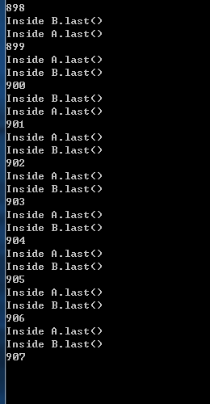
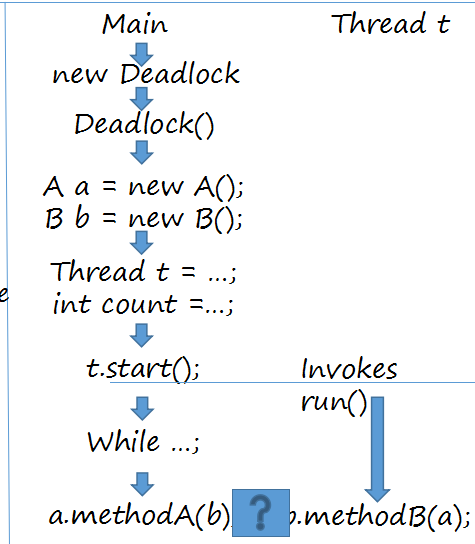

#Lab4 Deadlock
###第907次 出现死锁

###死锁产生的四个条件

> 互斥条件：一个资源每次只能被一个进程使用。

>  请求与保持条件：一个进程因请求资源而阻塞时，对已获得的资源保持不放。
 
>  不剥夺条件:进程已获得的资源，在末使用完之前，不能强行剥夺。
 
>  循环等待条件:若干进程之间形成一种头尾相接的循环等待资源关系。

###本次死锁产生的原因：
>  ppt上面说的也很清楚了：

   
   
> b使用了自己方法时使用了a的last方法

> 当a使用自己的方法时又使用了b的last方法

> 这样就会有问题 就是由于是synchronized的，所以是不能同时调用的，只能一次调用一个，就造成了死锁；
  