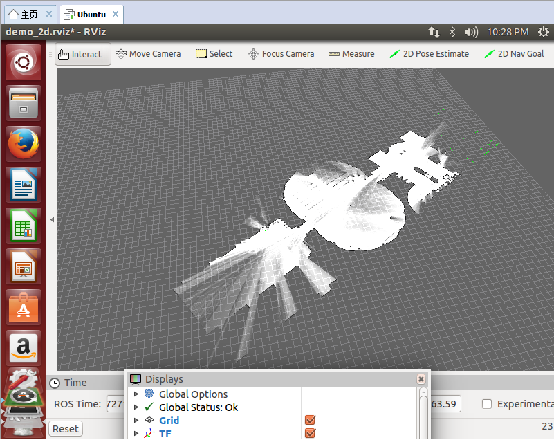

#Lab5：ROS与Cartographer配置
###显示出来的2D视图

###配置过程
####1.配置ROS
#####Setup your sources.list

> `sudo sh -c 'echo "deb http://packages.ros.org/ros/ubuntu $(lsb_release -sc) main" > /etc/apt/sources.list.d/ros-latest.list'`
#####Set up your keys

> `sudo apt-key adv --keyserver hkp://ha.pool.sks-keyservers.net:80 --recv-key 0xB01FA116`
#####Installation

> `sudo apt-get update`
> 
> `sudo apt-get install ros-jade-desktop-full`
> 
> `sudo apt-get install ros-jade-desktop`
> 
> `sudo apt-get install ros-jade-ros-base`
> 
> `sudo apt-get install ros-jade-PACKAGE`
> 
> `sudo apt-get install ros-jade-slam-gmapping`
> 
> `apt-cache search ros-jade`
#####Initialize rosdep
> `sudo rosdep init`
> 
>  `rosdep update`
#####Environment setup
> `echo "source /opt/ros/jade/setup.bash" >> ~/.bashrc`
> 
> `source ~/.bashrc`
>   or
> `source /opt/ros/jade/setup.bash`
> 
#####Getting rosinstall
> `sudo apt-get install python-rosinstall`
> 
#####Obtain source code of the installed packages
> `apt-get source ros-jade-laser-pipeline`

####2.配置Cartographer
#####0.安装所有依赖项
> `sudo apt-get install -y google-mock libboost-all-dev  libeigen3-dev libgflags-dev libgoogle-glog-dev liblua5.2-dev libprotobuf-dev  libsuitesparse-dev libwebp-dev ninja-build protobuf-compiler python-sphinx  ros-indigo-tf2-eigen libatlas-base-dev libsuitesparse-dev liblapack-dev`
#####1.首先安装ceres solver，选择的版本是1.11,路径随意(build文件夹自己创建)
> ` git clone https://github.com/hitcm/ceres-solver-1.11.0.git`
> 
> `cd ceres-solver-1.11.0/build`
> 
> `cmake ..`
> 
> `make`
> 
> `sudo make install`
#####2.然后安装 cartographer,路径随意(build文件夹自己创建)
> `git clone https://github.com/hitcm/cartographer.git`
> 
> ` cd cartographer/build`
> 
> `cmake .. -G Ninja`
> 
> `ninja`
> 
> `ninja test`
> 
> `sudo ninja install`
#####3.安装cartographer_ros(下载到catkin_ws下面的src文件夹下面)
> `git clone https://github.com/hitcm/cartographer_ros.git`
> 
> `cd ..`
> 
> `catkin_make`
####所有配置完成 开始数据测试
> `wget -P ~/Downloads https://storage.googleapis.com/cartographer-public-data/bags/backpack_2d/cartographer_paper_deutsches_museum.bag`
> 
> `roslaunch cartographer_ros demo_backpack_2d.launch bag_filename:=${HOME}/Downloads/cartographer_paper_deutsches_museum.bag`
> 
> 第一次跑到这里一般会有这个错误：
> 
> `[demo_backpack_2d.launch] is neither a launch file in package [cartographer_ros] nor is [cartographer_ros] a launch file name The traceback for the exception was written to the log file`
> 
> 这种错误的主要原因是ros的catkin_ws配置问题，可以运行`rospack profile`试试。
> 
> 接下来应该还有可能说一个连接不上server的问题：
> 
> 我参考了博客http://blog.csdn.net/u013453604/article/details/47423135
> 
> 解决办法如下：
> 
> `cd`
> 
> `gedit ~/.bashrc`
> 
> 最后三行加上
> 
> `export ROS_PACKAGE_PATH=$ROS_PACKAGE_PATH:/home/siat/ccny/ccny_vision:/home/siat/catkin_ws/src`
> 
> `export ROS_HOSTNAME=localhost`
> 
> `export ROS_MASTER_URI=http://localhost:11311`
>  
>  在跑测试就可以出现视图了